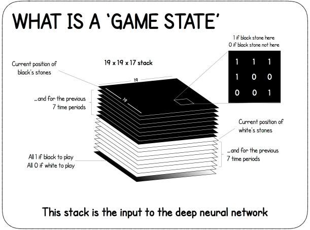
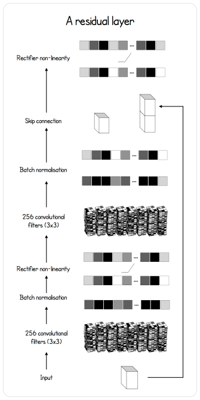
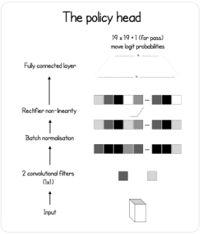
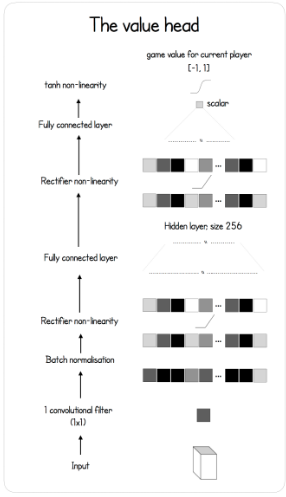

---

<br/>


DeepMind has shaken the world of Reinforcement Learning and Go with its creation _AlphaGo_, and later _AlphaGo Zero_. It is the first computer program to beat
a human professional Go player without handicap on a 19 x 19 board. It has also beaten the world champion **Lee Sedol** 4 games to 1, **Ke Jie** (number one world ranked player at the time) and many other top ranked players with the _Zero_ version. The game of Go is a difficult environment because of its
very large branching factor at every move which makes classical techniques such as alpha-beta pruning and heuristic search unrealistic. I will present my work
on reproducing the paper as closely as I could. This article will again require background knowledge in Machine Learning and Python, as I will make references to [my own implementation](https://github.com/dylandjian/SuperGo). It will also require a little bit of knowledge about the game of Go.

## Introduction

After watching and reading a lot of theory about Reinforcement Learning and Machine learning in general, I decided that I wanted to start implementing my first project. As a _(bad)_ Go player and self-taught student in the field, I felt like the promise of learning how to play such a complex game _tabula rasa_ was super interesting. I was using Keras at the time and really wanted to transition into PyTorch, so this was the perfect opportunity for it. It was a bit hard to get started on such a big project. The first resource that I found was [this amazing info graphic by David Foster](https://applied-data.science/static/main/res/alpha_go_zero_cheat_sheet.png) that I will be referencing throughout the article. After a few days of thinking and searching, I was ready to start building the entire pipeline, following the [Nature paper published by DeepMind](https://www.nature.com/articles/nature24270.epdf?author_access_token=VJXbVjaSHxFoctQQ4p2k4tRgN0jAjWel9jnR3ZoTv0PVW4gB86EEpGqTRDtpIz-2rmo8-KG06gqVobU5NSCFeHILHcVFUeMsbvwS-lxjqQGg98faovwjxeTUgZAUMnRQ).

## AlphaGo Zero

AlphaGo Zero pipeline is divided into three main components (just like the previous article on [World Models](https://dylandjian.github.io/world-models/)), each in a different process that runs the code asynchronously. The first component is the **self-play**. It is responsible for the data generation.
The second component is the **training**, where freshly generated data by the self-play component is used to improve the current best networks. The final part is the **evaluation**, which decides whether the trained agent is better than the agent that is currently used to generate data. This last part is crucial since generated data should always come from the best available networks in order to generate quality moves much quicker in the self-play process.
To better understand how these components interact with each other, I will describe the building blocks of the project independently and then later assemble them to form the global pipeline.

<center>. . .</center>

## The environment

Ideally, a good environment would be one where it is possible to play really fast and that has implemented the Go rules (atari, ko, komi and others). After some research, I stumbled upon an implementation in OpenAI Gym ([old version](https://github.com/openai/gym/blob/6af4a5b9b2755606c4e0becfe1fc876d33130526/gym/envs/board_game/go.py) that had the board environments) that was using [pachi_py](https://github.com/openai/pachi-py) which is a Python binding to the C++ [Pachi Go Engine](https://github.com/pasky/pachi). After a few tweaks the engine was ready to be used.
The first tweak is the fact that the input of the agent is a special representation of the board, as shown in the figure below. The state is composed of the current position of the black stones as a binary map (1 where there is a black stone, 0 otherwise) as well as the past 7 board states. It is concatenated with the same input for the white stones. This is mainly done in case of a _ko_.
Finally, a map full of 0 or 1 is added to represent which player is about to play. It is represented this way for the ease of implementation, however it can be encoded in a single bit otherwise.
<br />



The second tweak is to make sure that it is possible to play with the engine whether there is only one agent playing _(self-play, online)_ or two _(evaluation or with another agent)_. Also, in order to make the most out of modern CPUs, the code had to be modified in order to run multiple instances of the engine in parallel.

In addition to these tweaks, the code had to be adjusted to be able to use the Tromp-Taylor scoring to have a good estimate of the winner during the game in case it stops early (which will be explained in more details in the _training_ section below).

<center>. . .</center>

## The agent

The agent is composed of **three** neural networks that work together : a **feature extractor**, a **policy** network and a **value** network. This is also why AlphaGo Zero is sometimes called the _two headed beast_ : a body, which is the feature extractor, and two heads : policy and value. The feature extractor model creates its own representation of the board state. The policy model outputs a probability distribution over all the possible moves and the value model predicts a scalar value in the range $[-1;1]$ to represent which player is more likely to win given the current state of the board. Both the policy and value model use the output of the feature extractor as input. Let's see how they actually work.

### Feature extractor

The feature extractor model is a Residual Neural Network, which is a special Convolutional Neural Network _(CNN)_. Its particularity is that it has a skip connection before the output of a block. This type of connection is just adding the output of the last connection of the block with the input before applying a Rectified Linear Unit activation function _(ReLU)_ to the result, as described in the figure below.



Here is how it is defined in code.

```python
class BasicBlock(nn.Module):
    """
    Basic residual block with 2 convolutions and a skip connection
    before the last ReLU activation.
    """

    def __init__(self, inplanes, planes, stride=1, downsample=None):
        super(BasicBlock, self).__init__()

        self.conv1 = nn.Conv2d(inplanes, planes, kernel_size=3,
                        stride=stride, padding=1, bias=False)
        self.bn1 = nn.BatchNorm2d(planes)

        self.conv2 = nn.Conv2d(planes, planes, kernel_size=3,
                        stride=stride, padding=1, bias=False)
        self.bn2 = nn.BatchNorm2d(planes)


    def forward(self, x):
        residual = x

        out = self.conv1(x)
        out = F.relu(self.bn1(out))

        out = self.conv2(out)
        out = self.bn2(out)

        out += residual
        out = F.relu(out)

        return out
```

<br/>

Now that the Residual Block is defined, let's add it into the final feature extractor model as defined in the paper.

```python
class Extractor(nn.Module):
    def __init__(self, inplanes, outplanes):
        super(Extractor, self).__init__()
        self.conv1 = nn.Conv2d(inplanes, outplanes, stride=1,
                        kernel_size=3, padding=1, bias=False)
        self.bn1 = nn.BatchNorm2d(outplanes)

        for block in range(BLOCKS):
            setattr(self, "res{}".format(block), \
                BasicBlock(outplanes, outplanes))


    def forward(self, x):
        x = F.relu(self.bn1(self.conv1(x)))
        for block in range(BLOCKS - 1):
            x = getattr(self, "res{}".format(block))(x)

        feature_maps = getattr(self, "res{}".format(BLOCKS - 1))(x)
        return feature_maps
```

<br />

The final network is simply the result of a convolutional layer that is given as input to the residual layers.

### Policy head

The policy network model is a simple convolutional layer (1 x 1 convolution to encode over the channels of the feature extractor output) with a batch normalization layer and a fully connected layer that outputs the probability distribution over the entire board, plus one extra move for the pass move.



```python
class PolicyNet(nn.Module):
    def __init__(self, inplanes, outplanes):
        super(PolicyNet, self).__init__()
        self.outplanes = outplanes
        self.conv = nn.Conv2d(inplanes, 1, kernel_size=1)
        self.bn = nn.BatchNorm2d(1)
        self.logsoftmax = nn.LogSoftmax(dim=1)
        self.fc = nn.Linear(outplanes - 1, outplanes)


    def forward(self, x):
        x = F.relu(self.bn(self.conv(x)))
        x = x.view(-1, self.outplanes - 1)
        x = self.fc(x)
        probas = self.logsoftmax(x).exp()

        return probas
```

### Value head

The value network model is a bit more sophisticated. It also has the couple convolution, batch normalization, ReLU and then a fully connected layer. Another fully connected layer is added on top of that. Finally, a hyperbolic tangent is applied to create the scalar output in range $[-1;1]$ that represents how likely the player is to win given the current game state.



```python
class ValueNet(nn.Module):
    def __init__(self, inplanes, outplanes):
        super(ValueNet, self).__init__()
        self.outplanes = outplanes
        self.conv = nn.Conv2d(inplanes, 1, kernel_size=1)
        self.bn = nn.BatchNorm2d(1)
        self.fc1 = nn.Linear(outplanes - 1, 256)
        self.fc2 = nn.Linear(256, 1)


    def forward(self, x):
        x = F.relu(self.bn(self.conv(x)))
        x = x.view(-1, self.outplanes - 1)
        x = F.relu(self.fc1(x))
        winning = F.tanh(self.fc2(x))
        return winning
```

<br />

<center>. . .</center>

## Monte Carlo Tree Search

Another major component of AlphaGo Zero is the asynchronous Monte Carlo Tree Search _(MCTS)_. This tree search algorithm is useful because it enables the network to think ahead and choose the best moves thanks to the simulations that it has made, without exploring every node at every step. Since Go is a perfect information game with a perfect simulator, it is possible to simulate a rollout of the environment and plan the response of the opponent far ahead, just like humans do. Let's see how it is actually done.

### Node

Each node in the tree represents a board state and stores different statistics : the number of times the node has been visited _(n)_, the total action value _(w)_, the prior probability of reaching that node _(p)_, the mean action value (_q_, which is $q = w / n$) as well as the move made from the parent to reach that node, a pointer to the parent node and finally all the legal moves from this node that have a non-zero probability as children.

```python
class Node:
    def __init__(self, parent=None, proba=None, move=None):
        self.p = proba
        self.n = 0
        self.w = 0
        self.q = 0
        self.children = []
        self.parent = parent
        self.move = move
```

<br />

### Rollout

#### PUCT selection algorithm

The first action in the tree search is choosing the action that maximize a variant of the Polynomial Upper Confience Trees _(PUCT)_ formula. It allows the network to either explore unseen path early on, or further search the best possible moves later on thanks to the exploration constant _$c_{puct}$\_.
The selection formula is defined as follows.

$U(s, a) = c_{puct} * P(s, a) * \frac{\sqrt{\sum_b{N(s, b)}}}{1 + N(s, a)}$

with $P(s, a)$ the probability of being in that state and $N(s, a)$ the number of time that this specific state has been visited during the simulations.

Here is how it is defined in code. This version is slightly less readable because it is optimized using numba.

```python
def select(nodes, c_puct=C_PUCT):
    " Optimized version of the selection based of the PUCT formula "

    total_count = 0
    for i in range(nodes.shape[0]):
        total_count += nodes[i][1]

    action_scores = np.zeros(nodes.shape[0])
    for i in range(nodes.shape[0]):
        action_scores[i] = nodes[i][0] + c_puct * nodes[i][2] * \
                (np.sqrt(total_count) / (1 + nodes[i][1]))

    equals = np.where(action_scores == np.max(action_scores))[0]
    if equals.shape[0] > 0:
        return np.random.choice(equals)
    return equals[0]
```

#### Ending

The selection continues until a leaf node is reached. A leaf node is a node that has not been expanded yet, which means that it must have no children.

```python
def is_leaf(self):
    """ Check whether a node is a leaf or not """

    return len(self.children) == 0
```

<br/>

Once a leaf node is encountered, a random rotation or reflection of the state it contains is evaluated (because the rules of Go are invariant under rotation or reflection, more on that in the _training_ section) using the value and policy networks to get the value of the current state and the probabilities of all the next moves. All forbidden moves have their probability changed to 0, and the probability vector is then renormalized to sum to 1.
After that, the node is expanded with every legal moves (moves that have a non-zero probability in the _probas_ array) given the state in the node, with the following function.

```python
def expand(self, probas):
    self.children = [Node(parent=self, move=idx, proba=probas[idx]) \
                for idx in range(probas.shape[0]) if probas[idx] > 0]
```

#### Backup

Once the expansion is done, the statistics of the node and its parents are updated using the following function and loop, as well as the value that has been predicted by the value network.

```python
def update(self, v):
    """ Update the node statistics after a rollout """

    self.w = self.w + v
    self.q = self.w / self.n if self.n > 0 else 0
```

```python
while current_node.parent:
    current_node.update(v)
    current_node = current_node.parent
```

### Move selection

Now that the simulations have been made, each potential next move contains statistics that describe the quality of the move. The move selection follows two scenarios.
The first one is where AlphaGo plays competitively and the selected move is the most simulated one. This scenario is applied during the evaluation and when playing in general other than during training.
The second scenario is where a move is selected stochastically, by transforming the array of visited count into a probability distribution using the following scheme.

```python
total = np.sum(action_scores)
probas = action_scores / total
move = np.random.choice(action_scores.shape[0], p=probas)
```

<br/>

This selection method allows AlphaGo to explore more potential options earlier on during training. After a certain amount of move (which is the _temperature_ constant), the move selection becomes competitive.

## Final pipeline

Now that every individual building block has been explained, let's assemble them to see how AlphaGo has actually been trained.

At the start of the program, at least two "core" processes are launched. The first one is the self-play and the second one is the training. Ideally, both processes would communicate via _RAM_. However, it is not trivial to pass information between different processes, which in this case is sending the generated games in the self-play process to the training process in order to update the dataset with the best quality games to make the agent learn from better games faster. To do that, I decided to use a MongoDB database instead, to be able to have each process run independently with only one true source of information.

### Self-play

The self-play component is the one in charge of generating data. It works by using the current best agent to play against itself. After a game finishes (either by the two players passing, one of the player resigning or the number of moves becoming larger that a constant threshold), every registered action of the game is updated with the winner of the game, going from the shape _(board_state, move, player_color)_ to _(board_state, move, winner)_. Every time a batch is generated, the process verifies that the current agent used to generate games is still the best agent. The following function is a rough sketch of how to self-play actually works.

```python
def self_play():
    while True:
        new_player, checkpoint = load_player()
        if new_player:
            player = new_player

        ## Create the self-play match queue of processes
        results = create_matches(player, cores=PARALLEL_SELF_PLAY,
                                         match_number=SELF_PLAY_MATCH)
        for _ in range(SELF_PLAY_MATCH):
            result = results.get()
            db.insert({
                "game": result,
                "id": game_id
            })
            game_id += 1
```

### Training

The training is relatively straightforward as well. The current best agent is trained using the new generated games. Each state in the dataset is augmented by applying all the dihedral rotations of a square (rotations and symmetries) to it to increase the size of the dataset. Every few iterations, the training process checks the database to see if the self-play process has generated new games and if it is the case, the training process fetches them and updates the dataset accordingly. After some iterations, the trained agent is sent to evaluation asynchronously in another process, as described in the function below.

```python
def train():
    criterion = AlphaLoss()
    dataset = SelfPlayDataset()
    player, checkpoint = load_player(current_time, loaded_version)
    optimizer = create_optimizer(player, lr,
                                    param=checkpoint['optimizer'])
    best_player = deepcopy(player)
    dataloader = DataLoader(dataset, collate_fn=collate_fn, \
                batch_size=BATCH_SIZE, shuffle=True)

    while True:
        for batch_idx, (state, move, winner) in enumerate(dataloader):

            ## Evaluate a copy of the current network
            if total_ite % TRAIN_STEPS == 0:
                pending_player = deepcopy(player)
                result = evaluate(pending_player, best_player)

                if result:
                    best_player = pending_player

            example = {
                'state': state,
                'winner': winner,
                'move' : move
            }
            optimizer.zero_grad()
            winner, probas = pending_player.predict(example['state'])

            loss = criterion(winner, example['winner'], \
                            probas, example['move'])
            loss.backward()
            optimizer.step()

            ## Fetch new games
            if total_ite % REFRESH_TICK == 0:
                last_id = fetch_new_games(collection, dataset, last_id)
```

<br/>

The loss function which is used to train the agent is the sum of the mean-squared error between the actual winner of the game and the predicted value, and the cross-entropy loss between the move that has been made and the predicted probability distribution. It is defined as follows in code.

```python
class AlphaLoss(torch.nn.Module):
    def __init__(self):
        super(AlphaLoss, self).__init__()

    def forward(self, pred_winner, winner, pred_probas, probas):
        value_error = (winner - pred_winner) ** 2
        policy_error = torch.sum((-probas *
                                (1e-6 + pred_probas).log()), 1)
        total_error = (value_error.view(-1) + policy_error).mean()
        return total_error
```

### Evaluation

The evaluation consists of the current best agent playing against the trained agent using the competitive parameter (no exploration). They play a certain amount of games against each other, and if the trained agent beats the current best agent more than a certain amount of the time (55% of the time in the paper), then the trained agent is saved and becomes the new best agent.

```python
def evaluate(player, new_player):
    results = play(player, opponent=new_player)
    black_wins = 0
    white_wins = 0

    for result in results:
        if result[0] == 1:
            white_wins += 1
        elif result[0] == 0:
            black_wins += 1

    ## Check if the trained player (black) is better than
    ## the current best player depending on the threshold
    if black_wins >= EVAL_THRESH * len(results):
        return True
    return False
```

## Results

After a week of training on my school's server, the agent played approximately 20k self-played games on a 9x9 Go board, using 128 MCTS simulations, playing 10 games in parallel. It did approximately 463k parameters update, with the best agent being replaced 417 times. Here is a clip of the best agent playing against himself.

`youtube:https://www.youtube.com/embed/rkxBqK7f8qA`

As the video shows, the agent did not learn the "fundamentals" of the game, like life and death, or even atari. However, it seems to have learned that it is generally a good move to answer locally. It also looks like the agent knows that Go is about territory and not frontal combat, which is shown in the first few moves. The shapes are also really bad, and the agent still plays inside his own living groups and killing them by removing liberties.

## Discussion

I wasn't able to get any promising results. It raises the question of whether I made errors in the implementation, or perhaps I used wrong hyperparameters. AlphaGo Zero was trained using 4.9 million games but with a way higher number of simulations (1600), so the poor results might also come from a lack of computation.

## Acknowledgements

I want to thank my school's AI association for letting me use the server to try to train this implementation of AlphaGo Zero. I would also like to thank everyone that gives feedback on the article. Be sure to get in touch with me if you have any suggestions or remarks about it.

## References

- [The code for this article](https://github.com/dylandjian/superGo)
- [Mastering the game of Go without human knowledge](https://www.nature.com/articles/nature24270.epdf?author_access_token=VJXbVjaSHxFoctQQ4p2k4tRgN0jAjWel9jnR3ZoTv0PVW4gB86EEpGqTRDtpIz-2rmo8-KG06gqVobU5NSCFeHILHcVFUeMsbvwS-lxjqQGg98faovwjxeTUgZAUMnRQ) - DeepMind
- [Very nice infographic on AlphaGo Zero](https://applied-data.science/static/main/res/alpha_go_zero_cheat_sheet.png) - David Foster
- [Pachi Go game engine](https://github.com/pasky/pachi) - Petr Baudis
