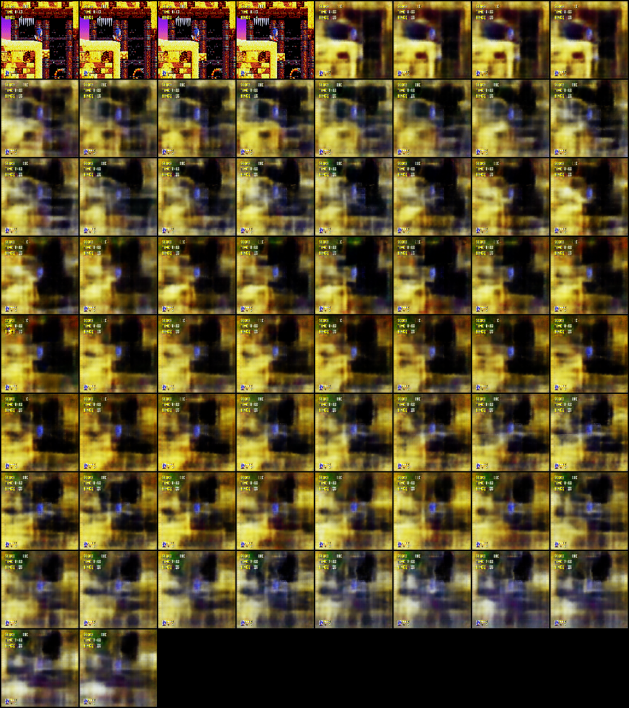

<br/>


<br/>

Open AI lauched a Reinforcement Learning competition called the [Retro Contest](https://contest.openai.com/) on April 5th. The contest lasted over the course of the past 2 months, and the goal was to make the best agent to play the old SEGA Genesis platform game Sonic the Hedgehog. The problem is really simple to understand, yet very **very** hard to resolve. The evaluation of the agent is done on levels that have not been previously seen by the agent, therefore making the competition a Meta Reinforcement Learning problem. I will present how I tried to tackle this problem by applying recently published techniques that have been used to solve to similar problems (however generally simpler). This article will require a bit of background knowledge in Machine Learning and Python, as I will be referencing [my own implementation](https://github.com/dylandjian/retro-contest-sonic).

## Introduction

I started the contest about 3 to 4 weeks ago _(May 10th)_, with general knowledge about Machine Learning and Deep Learning as a self taught practitioner and student in software development. My only other experience with a large Reinforcement Learning problem was implementing AlphaGo Zero from scratch, using (mainly) PyTorch. [My article on the subject](https://dylandjian.github.io/alphago-zero/) and [my implementation on Github](https://github.com/dylandjian/superGo).

I followed the [guidelines](https://contest.openai.com/details) to get started and submitted my first agent using a random policy.
When it was time to start thinking about a way to formulate a good answer to the problem, a few ideas came to my mind : Proximal Policy Optimization _(PPO)_, Deep-Q Networks _(DQN)_ and it's variations or perhaps the Trust Region Policy Optimization _(TRPO)_ algorithm. However, these algorithm have already proven their worth and are known performers. I wanted to try something different even though it might not give any successful results.

I read the paper about [**World Models**](https://arxiv.org/pdf/1803.10122.pdf) a few weeks prior to starting the contest. I had thought about a similar approach before reading the paper, but never actually took the time to experiment with it myself. I figured it was the perfect time to apply this really interesting approach to a concrete problem.

## World Models

The algorithm is divided in 3 main components that have their own logic. **V**isual, **M**emory, **C**ontrol. The underlying idea is pretty elegant. As humans, we learn our own abstract representation of the dynamics of the world we live in, whether it is in time or in space. We have the ability to _roughly_ visualize a concept when we think about one.

Let's say I ask you to visualize what a Sonic level might look like to you. If you have already seen or played Sonic, you are probably thinking about a rough sketch of a level, not the RGB value of every pixel of the level. If you haven't, [here](http://cdn.pastemagazine.com/www/articles/green%20hill%20zone.png) is a picture of a level so you can get the idea. If I now ask you to imagine how Sonic is going to act on that level you just thought of, you can probably see him move through the level, as well as avoiding cracks on the ground, enemy units and getting golden rings in order to achieve a higher score.
The goal of the paper was to replicate this beautiful architecture, which they successfully did on 2 environments : the _CarRacing-v0_ in OpenAI Gym, and Doom. My goal was to try to apply this architecture to Sonic.

<center>. . .</center>

## Visual Model

### Concept

The visual model that is supposed to create the abstract representation of the space is called an Autoencoder. It is basically made of 2 components, an encoder and a decoder. The job of the encoder is to compress the observation (in our case the RGB frame of the game) into a vector with a much smaller dimension (generally between 10 and 300 dimensions depending on the underlying estimated complexity of the environment, 64 in the paper for Doom). On the other hand, the job of the decoder is to try to recreate the original RGB frame from the compressed vector. The Autoencoder variant that has been used in the paper is called a Variational Autoencoder _(VAE)_. [Here is a good resource on the subject](https://jaan.io/what-is-variational-autoencoder-vae-tutorial/). Instead of encoding the frames to a latent variable $z$ directly, the encoder tries to compress the frame into a Normal probability distribution with mean $μ$ and standard deviation $σ$.

Also, since the inputs of our model are images it seems logical to use convolutions in order to capture local information instead of using pixel values directly.
I chose to implement the [$β$-VAE](https://arxiv.org/pdf/1804.03599.pdf) variant to get a more robust representation of the Sonic levels.

### Code

Let's take a look at a possible implementation. The architecture follows the one proposed in the paper, except that it has one more layer because the frames taken from the game have been resized to 128 x 128 x 3 (using the _nearest_ interpolation method from [opencv2](https://docs.opencv.org/2.4/modules/imgproc/doc/geometric_transformations.html)) instead of 64 x 64 x 3 in the paper.

```python
class ConvVAE(nn.Module):
    def __init__(self, input_shape, z_dim):
        super(ConvVAE, self).__init__()

        ## Encoder
        self.conv1 = nn.Conv2d(3, 32, 4, stride=2)
        self.conv2 = nn.Conv2d(32, 64, 4, stride=2)
        self.conv3 = nn.Conv2d(64, 128, 4, stride=2)
        self.conv4 = nn.Conv2d(128, 256, 4, stride=2)

        ## Latent representation of mean and std
        self.fc1 = nn.Linear(256 * 6 * 6, z_dim)
        self.fc2 = nn.Linear(256 * 6 * 6, z_dim)
        self.fc3 = nn.Linear(z_dim, 256 * 6 * 6)

        ## Decoder
        self.deconv1 = nn.ConvTranspose2d(256 * 6 *6, 128, 5, stride=2)
        self.deconv2 = nn.ConvTranspose2d(128, 64, 5, stride=2)
        self.deconv3 = nn.ConvTranspose2d(64, 32, 5, stride=2)
        self.deconv4 = nn.ConvTranspose2d(32, 16, 6, stride=2)
        self.deconv5 = nn.ConvTranspose2d(16, 3, 6, stride=2)
```

<br/>

First is the definition of our layers. 4 convolutions that are mapped onto 2 linear vectors representing the mean and the standard deviation of our VAE. Then another linear layer is added that takes the ouput _(mean, std)_ and maps it to a vector that will be the input of the decoder. The decoder will reconstruct the image to the size of the input image in order to calculate the loss function.

Now onto the forward pass.

```python
def encode(self, x):
    h = F.relu(self.conv1(x))
    h = F.relu(self.conv2(h))
    h = F.relu(self.conv3(h))
    h = F.relu(self.conv4(h))
    h = h.view(-1, 256 * 6 * 6)
    return self.fc1(h), self.fc2(h)


def reparameterize(self, mu, logvar):
    std = torch.exp(0.5 * logvar)
    eps = torch.randn_like(std)
    return eps * std + mu


def decode(self, z):
    h = self.fc3(z).view(-1, 256 * 6 * 6, 1, 1)
    h = F.relu(self.deconv1(h))
    h = F.relu(self.deconv2(h))
    h = F.relu(self.deconv3(h))
    h = F.relu(self.deconv4(h))
    h = F.sigmoid(self.deconv5(h))
    return h


def forward(self, x, encode=False, mean=True):
    mu, logvar = self.encode(x)
    z = self.reparameterize(mu, logvar)
    if encode:
        if mean:
            return mu
        return z
    return self.decode(z), mu, logva
```

<br/>

The encode and decode methods do as their name suggest. The reparameterize method is used to sample from the mean and standard deviation during training, and a good practice is to use the mean when infering. However, to make sure that our **M**emory model doesn't overfit to a specific latent representation $z$ while learning how to model the time dependency on the space, the sampling method is also used, even during inference time.

The final piece is the loss function.

```python
def loss_fn(recon_x, x, mu, logvar):
    batch_size = x.size(0)
    loss = F.binary_cross_entropy(recon_x, x, size_average=False)
    kld = -0.5 * torch.sum(1 + logvar - mu.pow(2) - logvar.exp())
    loss /= batch_size
    kld /= batch_size
    return loss + BETA * kld.sum()
```

<br/>

The loss function for the β-VAE is defined as follows :

$E_{q_\phi(z|x)}[\log p_θ(x|z)] - βD_{KL}(q_{\phi}(z|x)\ ||\ p(z))$

The left term is the marginal likelihood which measures how close the predicted frame was from the original frame, and the right term is the Kullback–Leibler divergence (or relative entropy) which is a measure of how the predicted frame diverges from the original frame when considered as a probability distribution, under the assumption that $p(z)$ and $q_{\phi}(z|x)$ are parametrised as Gaussians distributions. I also normalized each component of the loss by the number of example in the batch to get a more representative value.

<center>. . .</center>

## Memory Model

### Concept

The **M**emory Model is reponsible for the representation of the changes in space through time caused by an action. A popular model for time series modelling is called a Recurrent Neural Network _(RNN)_. In order to represent time, this type of model uses it's own predictions as input source during the forward pass, hence the term _recurrent_. This is illustrated in the figure down below.

<br/>


<br />

However, Vanilla RNNs have several shortcomings. The first one is that they tend to struggle to model long term dependencies, since the context can sometimes be quite far back in the sequence. The second issue (which is directly correlated to the first one) is the vanishing gradient problem, which is caused by the backpropagation algorithm applied to RNNs, called backpropagation through time _(BPTT)_. Several techniques have addressed these issues such as the Rectified Linear Unit activation function _(ReLU)_, gradient clipping or the Gated Recurrent Unit _(GRU)_.

In the **World Model** paper, the authors decided to use a Long Short Term Memory Network _(LSTM)_ instead. This model has been specifically designed to model long term dependencies and overcome these issues thanks to a specific gating mechanism that I won't explain here, but [this article explains the key ideas quite well](http://colah.github.io/posts/2015-08-Understanding-LSTMs/).

As well as using a LSTM, they also used a Mixed (or Mixture) Density Network _(MDN)_ to have multiple possible outputs for a single input, which in this case is the concatenation of the current encoded frame (output of the encoder defined above) and the action that our agent is taking. It is called _Mixed Density_ because the network outputs the parameters of a certain number of Gaussian probability distributions, as well as a probability vector that represents how much each of the predicted Gaussian should contribute to the final prediction of the latent vector $z_{t+ 1}$. [Here is another article that I find very well written on the subject](https://mikedusenberry.com/mixture-density-networks).

### Code

This time, the paper did not propose a complete description of the architecture, except that they used 512 hidden units and 5 Gaussians mixtures for the Doom experiment. I later found out that they also used a pretty long sequence length (1000) during training, [ref. to the post](https://github.com/worldmodels/worldmodels.github.io/issues/6).

```python
class LSTM(nn.Module):
    def __init__(self, sequence_len, hidden_units, z_dim, num_layers, n_gaussians, hidden_dim):
        super(LSTM, self).__init__()

        self.n_gaussians = n_gaussians
        self.num_layers = num_layers
        self.z_dim = z_dim
        self.hidden_dim = hidden_dim
        self.hidden_units = hidden_units
        self.sequence_len = sequence_len
        self.hidden = self.init_hidden(self.sequence_len)

        ## Encoding
        self.fc1 = nn.Linear(self.z_dim + 1, self.hidden_dim)
        self.lstm = nn.LSTM(self.hidden_dim, hidden_units, num_layers)

        ## Output
        self.z_pi = nn.Linear(hidden_units, n_gaussians * self.z_dim)
        self.z_sigma = nn.Linear(hidden_units, n_gaussians * self.z_dim)
        self.z_mu = nn.Linear(hidden_units, n_gaussians * self.z_dim)

    def init_hidden(self, sequence):
        hidden = torch.zeros(self.num_layers, sequence, self.hidden_units, device=DEVICE)
        cell = torch.zeros(self.num_layers, sequence, self.hidden_units, device=DEVICE)
        return hidden, cell
```

<br/>

Again, the definition of the layers comes first. Before going through the LSTM layer(s), the latent encoded vector $z_t$ passes through a linear layer to help the model makes it's own non-linear representation on top of the latent representation.

After that, it is mapped onto the LSTM layers, which will output a time-encoded vector. This vector will itself be mapped onto the 3 components of our MDN, which are the probability, the mean $μ$ and the variance $σ$ for each value of each mixture.

The forward pass is relatively straight forward (**!**)

```python
def forward(self, x):
    self.lstm.flatten_parameters()

    x = F.relu(self.fc1(x))
    z, self.hidden = self.lstm(x, self.hidden)
    sequence = x.size()[1]

    pi = self.z_pi(z).view(-1, sequence, self.n_gaussians, self.z_dim)
    pi = F.softmax(pi, dim=2)
    sigma = torch.exp(self.z_sigma(z)).view(-1, sequence,
                    self.n_gaussians, self.z_dim)
    mu = self.z_mu(z).view(-1, sequence, self.n_gaussians, self.z_dim)
    return pi, sigma, mu
```

<br />

The hidden state is updated, the probabilities are calculated with a softmax (to transform the output to a probability distribution that sums to 1) and the variance $σ$ is exponentiated. All these 3 vectors are shaped to correspond to _(batch_size, sequence_length, n_gaussians, latent_dimension)_.

Then is the definition of our loss function.

```python
def mdn_loss_function(out_pi, out_sigma, out_mu, y):
    y = y.view(-1, SEQUENCE, 1, LATENT_VEC)
    result = Normal(loc=out_mu, scale=out_sigma)
    result = torch.exp(result.log_prob(y))
    result = torch.sum(result * out_pi, dim=2)
    result = -torch.log(EPSILON + result)
    return torch.mean(result)
```

<br/>

The predicted vector is converted into a multivariate Gaussian distribution. It is evaluated for the true latent vector of the target (which is the latent vector of the next frame $z_{t+1}$) and then the probability vector for each mixture is applied. Finally, the mixtures are summed, a logarithm (with a small constant to avoid -$\infty$) is applied and this value is then normalized by the _batch_size_ to give the final loss value.

However, this is not numerically stable (logarithm of softmax), but in the paper the correlation parameter $\rho$ is not modeled therefore it is possible to implement a version that is numerically stable.

<center>. . .</center>

## Controller Model

### Concept

The **C**ontroller model is in charge of taking actions in the environment. In the paper, it is a simple neural network with a single linear layer that maps the concatenation of the current latent representation of the frame $z_t$ and the hidden state and cell of the LSTM to an action (depending on the environment, the output shape might be a bit different).

I tried different approaches to adapt the model's output to the Sonic environment, such as using a discrete value with a softmax operation at the end, which didn't seem to work very well. I also tried outputing a hyperbolic tangent value ($[-1,1]$) and split it in equally likely segment that would represent an action, which didn't work either. The best method was to predict a sigmoid value for every independant button of the SEGA controller that has an impact on the game. The **UP** button has little to no use, same goes for **A** and **C** which do the same actions as **B**, as shown in [this wiki](https://strategywiki.org/wiki/Sonic_the_Hedgehog/Controls). The action was taken by pushing all the buttons that had an activation that was superior to a certain threshold (0.5 in my case).

The method that was used in the paper to train the agent in the environment is an evolutionary algorithm called the Covariance Matrix Adaptation Evolution Strategy _(CMA-ES)_. [Here is a really great visual guide written by hardmaru](http://blog.otoro.net/2017/10/29/visual-evolution-strategies/). This algorithm has the particularity of having a dynamic standard deviation which enables the search space to adaptively increase or decrease depending on the situation. They used this evolutionary technique in order to find the set of parameters that would make the agent perform best in the environment. In our case, the fitness function (which is responsible for the calculation of how well an agent is doing during an episode) is defined by OpenAI with two components : a horizontal offset (which is the x coordinate on the level), and a completion bonus, which sums up to 9000 possible total score.

To make sure that outliers don't make the algorithm converge towards a local minima, a fitness shaping function is applied to the fitness score of each set of parameters.

### Code

The Controller model is composed of a single linear layer with 8896 weights parameters (200 for the latent dimension, 1024 _ 2 for the hidden state and cell of the LSTM _ 4 for the action space), because as recommended by the author of the paper and the other of pycma, the search space should not go much further than 10 000 parameters.

```python
class Controller(nn.Module):
    def __init__(self, hidden_dim, action_space):
        super(Controller, self).__init__()

        self.fc1 = nn.Linear(hidden_dim, action_space)

    def forward(self, x):
        x = F.sigmoid(self.fc1(x))
        return x
```

<br />

I used the package called **pycma** with the little wrapper from _hardmaru_ called [es.py](https://github.com/hardmaru/estool/blob/master/es.py) that I slightly modified. The algorithm is instantiated as follows, with a population size (which is the number of set of parameters generated at each timestep) and an intial standard deviation.

```python
 solver = CMAES(PARAMS_CONTROLLER, ## Number of parameters
                sigma_init=SIGMA_INIT,
                popsize=POPULATION)
```

<br />

The fitness shaping function is ranking the fitness scores to $[1, len(x)]$ then normalizing them by the number of samples and finally scaling them to the range $[-0.5, 0.5]$. This allows the algorithm to avoid outliers that would achieve a really high score and therefore dominate the gradient calculation in the optimization phase of the search space.

```python
def compute_ranks(x):
  """
  Returns ranks in [0, len(x))
  Note: This is different from scipy.stats.rankdata, which returns
  ranks in [1, len(x)].
  """
  assert x.ndim == 1
  ranks = np.empty(len(x), dtype=int)
  ranks[x.argsort()] = np.arange(len(x))
  return ranks

def rankmin(x):
  y = compute_ranks(x.ravel()).reshape(x.shape).astype(np.float32)
  y /= (x.size - 1)
  y -= .5
  return y
```

<br />

<center>. . .</center>

## Training and playing

Now that the concept and the code for our models are defined, let's move on to the actual training pipeline.

### Generating data

In the paper, they recommend using a random policy to generate the pair (frame, action) that will be required in order to train our **V** and **M** models later on. I tried that approach at the beginning by running the JERK algorithm (_Just Enough Retained Knowledge_ : mainly goes right and jumps, with a little backtracking to the left from time to time, taken from the [baselines repository](https://github.com/openai/retro-baselines/) released by OpenAI) to generate frames. However, since the agent gets stuck relatively quickly, the distribution of frames becomes biased towards where the agent gets stuck since certain frames would appear more often than others. To overcome this issue, I used human recordings instead of the JERK algorithm to generate data (as recommended by _unixpickle_ on Discord) to get a better distribution of the frames, and also to be able to see part of the levels that couldn't otherwise be explored by the JERK algorithm.

I chose to store the data in chunk of 2500 tuples of (frame, action, reward) in a database, mainly for the ease of use (only a few lines of Python using MongoDB).

### Training procedure

There are a few ways to approach the training procedure. I chose to train each model separately. I used the optimizer Adam with a learning rate of $10^{-3}$ for both the VAE and the LSTM.

I started training the VAE using a 200 dimensions latent space, a _batch_size_ of 300 frames (128 x 128 x 3) and a $β$ value of 4 in most of my experiments to enforce a better latent representation $z$, despite the potential quality loss on the overall reconstructed image. It lasted for approximately 2 days, which led to 400k ~ batch iterations.

On the other hand, I also started training the LSTM. I tried to fiddle with the hyper parameters of the model, but the last version I have is using 1 LSTM layer, 8 Gaussians, 1024 hidden units, and 1024 units in the first linear layer. I also used a sequence of 500 latent vector $z$ to be able to capture more of the time dependency. I only managed to train it for 14 hours ~ (submission deadline) which approximately represents 40k sequences of 500 latent vectors. To be able to create the target vector, I shifted the target by 1 frame to the left, and duplicated the last frame. I tried using a larger shift without duplication, but the results weren't as great from the _(little)_ time I had to experiment with it.

Also, instead of loading the raw frames into GPU memory, the $\mu$ and $\sigma$ of each frame is stored and new latent representations are sampled while constructing training batches.

Since I'm not training "online", I did also have a "rotating buffer" that was refreshed every few epochs to replace a small portion of the dataset (between 5 and 10% at most). Check [this piece of code](https://github.com/dylandjian/retro-contest-sonic/blob/master/lib/train_utils.py) for more details.

The last component, which is the **C**ontroller, is the hardest one to train from what I've experienced. The first thing I did was implement the multiprocessing for the evaluation of a given set of parameters to speed up computation. I also added some "early stopping" mechanism to save computation, such as calculating a moving average of the reward using a certain number of timesteps (300 to 600 timesteps, which is equivalent to between 20s and 40s in game at 15 frames per second), which would make the agent stop if the average reward didn't go above a certain threshold (10 in most of my experiments).

I tried using a _curriculum learning_ approach by only iterating on the first levels (GreenHillZone Act 1 and 2) until a certain score was achieved. On these levels, rewards tends to be easier to get earlier on and the agent should be able to learn the most basic concepts of Sonic such that going right and jumping over obstacles generally is a good idea. After a very few number of attempts, I decided to swap to a random approach, such that the agent would construct a better and more robust vision of the game progressively. However, at the time of writting, I didn't have enough training time to be able to assess if one is better than the other.

For the hyperparameters of the CMA-ES and the **C**ontroller models, I used a population of 80, evaluating 20 of the candidate solutions in parallel by taking the average cumulative reward on 5 rollouts until completion in either time or reward shortage. In the World Models paper, they had more than 1000 generations (with a population of size 64 and averaging on 16 rollouts) before achieving their score on the Car-Racing environment. The maximum number of generations I could do was around 80 before the submission deadline.

### Rollout of the agent

The agent plays in the environment with the logic described below (written in python pseudo-code, look at [this](https://github.com/dylandjian/retro-contest-sonic/blob/master/lib/agent_play.py) for the complete logic).

```python

def rollout(env, vae, lstm, controller):
    done = False
    obs = env.reset()
    mov_avg_reward = []
    total_reward = 0
    total_steps = 0

    while not done and total_steps < MAX_STEPS:
        if total_steps % SEQUENCE == 0:
            lstm.hidden = lstm.init_hidden(1)

        z = vae(obs)
        action = controller([z, lstm.hidden])
        obs, reward, done = env.step(action)
        _ = lstm([z, action]) ## Hidden state updated in forward pass

        if len(mov_avg_reward) == REWARD_BUFFER:
            if np.mean(mov_avg_reward) <= REWARD_THRESHOLD:
                break
            mov_avg_reward.insert(0, reward)
            mov_avg_reward.pop()
        else:
            mov_avg_reward.append(reward)

        total_steps += 1
        total_reward += reward

```

<br />

The hidden state of the LSTM is only re-initialized after a certain number of frames (the same amount that it used during training). It is also updated during the forward pass which is the reason why the return of the LSTM prediction isn't used.

<center>. . .</center>

## Results

All the pieces of the puzzle have now been laid down. Let's explore the final results that the model achieved by looking at every component individually.

### VAE

The VAE seems to have understood the fact that Sonic is a re-occuring character on all the frames. It has also learnt how to reconstruct the frame well from my observations.
Here is a sample of 4 frames reconstructed.


Since the VAE has a latent space, it is possible to do some linear interpolations between levels, such as the following.


### MDN-RNN

The LSTM seems to have also understood some _basic_ motions, such that when Sonic is about to fall the character will slowly go down, which I find pretty impressive ! The reconstructed images also tends to get blurry as time goes on, which is a good sign that the model is less certain about the "long term" future. However, I believe that the network hasn't been trained for long enough, mainly due to the submission deadline.
To create the image, I took the frame on the top left, encoded it to the latent space and concatenated the discrete action for the _move right_. Here is an example (first 4 images are true images, the 4 next are their reconstructions. The LSTM predictions start at the second line, with the first reconstructed frame as input).



### Controller

The results of the controller are ok-_ish_ and what I would call promising as of now considering how _little_ it has been trained. The variance of the agents results is still **very** high. However, from what I could observe, the best agents kept improving over time while the average score didn't increase as much (although I didn't make my training script record the average score per level to compare them as time goes on).

From analysing the generated footages, it seems that the controller has understood that going right and jumping over obstacles when stuck is generally a good idea, and on some levels it also seems that it has understood what an enemy unit is and a few other details. The overall gameplay looks promising when the level is not too complicated. Also, it is noticeable that this behavior has been heavily influenced by the "early-stopping" mechanism, because it doesn't really allow Sonic to go left and explore, since controllers that do that will get shut down relatively early on and therefore have a low reward, so the CMA-ES won't encourage this behavior (to save computation).

The agent that achieves the highest score in any of the levels while training is saved. The best agent at this time did around 4500 score at generation ~ 150. It achieves 2000 score on average over all the Sonic levels of the 3 games. Here are some footages using this agent **without** retraining on these levels specifically for the videos. In the first video Sonic manages to complete the level (around 9000+ score), and in the second video around 4500.

`youtube:https://www.youtube.com/embed/KDAhmhAHMeY`
`youtube:https://www.youtube.com/embed/miiayJPrFgg`

### Submission results

I started experimenting with the submission process only a few hours before the end of the competition. Also, the controllers were still evolving and were only around generation 80 ~ when I did my final submission. I didn't submit the best agent either, I only used the saved state of the latest CMA-ES and generated new controllers on the fly from the saved parameters. Since the results are based on the average score of the agent over the 1 million timesteps, what I did was that if an agent generated by the CMA-ES had more than 2000 score, it would play again with the same agent until the end of the evaluation instead of generating new ones. This achieved around 1800 scores, with one of the levels being completed at 8100 ~ score. The average of the highest scores on evaluation levels would have laid around 2500 to 4000. I didn't have enough time to submit the overall best generated agent without any training at all on the evaluation levels, but I believe that it would still maintain a pretty good average score and behavior.

## Discussion

There are a few points that could improve the performances of the agent. The first one is the VAE. There are models that have shown better results when encoding to a latent space, such as Generative Adversarial Networks _(GAN)_ and its variants. Also, in my implementation, I made some hyperparameters choices that were certainly suboptimal. More time would have definitely helped to get sharper results and make better implementation choices. The fact that I used the "early stopping" mechanism made Sonic learn a forced behavior instead of its own, which lead to different results. I also suspect the fitness shaping function to encourages bad behavior in some aspect, but I need to investigate this further. I would have liked to use the natural environment without any human constraints.

While writing this article, I also realized an implementation error that I made, which is that I used the human recordings at 60 FPS and trained the LSTM on it. However, the evaluation levels are run at 15 FPS. I didn't think it would make that big of a difference, however, the average score on all the levels by the same agents between the environment at 15 and 60 FPS is a bit larger than what I expected : 1830 for 15 FPS and 2004 for 60 FPS. _Oups_. Lastly, I thought that I would have enough time to use the levels of the leaderboard as evaluation, so I didn't save any while training, which turns out to be a mistake, especially if OpenAI doesn't decide to release the test levels.

Despite the bad results shown on the contest leaderboard, I still believe that Unsupervised methods such as this one are really promising for the future of Reinforcement Learning and Machine Learning in general.

## Acknowledgements

Thanks to OpenAI for hosting such a great competition, I hope that there will be many more. Also thanks for the help you provided on the Discord of the contest !
I would like to thank my school AI Association for helping me to get access to much greater computation resources that I have at home (thanks Alain for taking the time to help me get setup). Also a huge thanks to everyone that took time to review this article. And a final thanks to my cat _Milky_ for helping me stay awake late at night.

## References

- [The code for this article](https://github.com/dylandjian/retro-contest-sonic)
- [Retro Contest](https://contest.openai.com/) - OpenAI
- [Variational Autoencoder Tutorial](https://jaan.io/what-is-variational-autoencoder-vae-tutorial/) - Jaan Altosaar
- [Long Short Term Memory Networks article](http://colah.github.io/posts/2015-08-Understanding-LSTMs/) - Christopher Olah
- [Mixed Density Networks tutorial](https://mikedusenberry.com/mixture-density-networks) - Mike Dusenberry
- [Another tutorial on Mixed Density Networks](https://github.com/hardmaru/pytorch_notebooks/blob/master/mixture_density_networks.ipynb) - David Ha
- [Visual Guide to Evolution Strategies](http://blog.otoro.net/2017/10/29/visual-evolution-strategies/) - David Ha
- [World Models](https://arxiv.org/pdf/1803.10122.pdf) - David Ha, Jürgen Schmidhuber
- [β-VAE](https://arxiv.org/pdf/1804.03599.pdf) - DeepMind
- [PyTorch](https://github.com/pytorch/) - Adam Paszke, Sam Gross, Soumith Chintala, Gregory Chanan
- [pycma](https://github.com/CMA-ES/pycma) - Nikolaus Hansen
