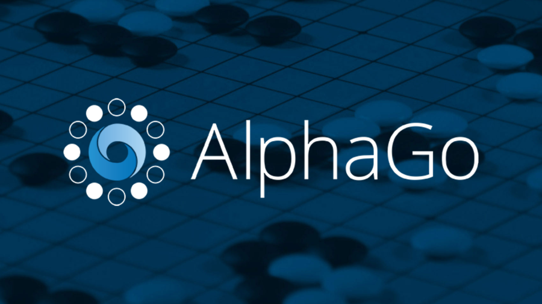
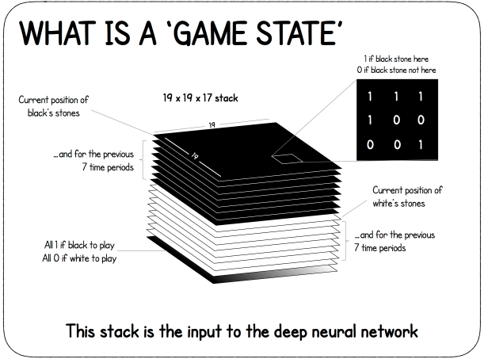
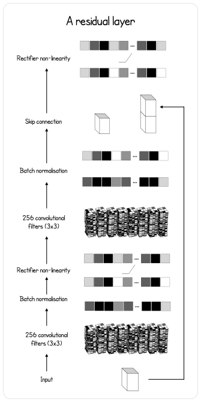
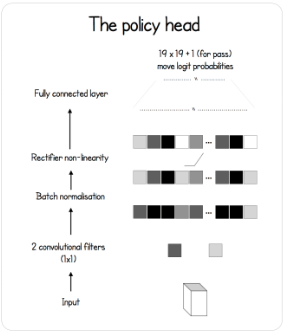
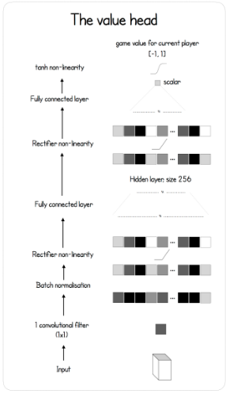

<br/>



<br/>


DeepMind has shaken the world of Reinforcement Learning and Go with it's creation *AlphaGo*, and later *AlphaGo Zero*. It is the first computer program to beat 
a human professional Go player without handicap on a 19 x 19 board. It has also beaten the world champion **Lee Sedol** 4 games to 1, **Ke Jie** (number 1 world ranked player at the time) and many other top ranked players with the *Zero* version. The game of Go is a difficult environment because of its
very large branching factor at every move which makes classical techniques such as alpha-beta pruning and heuristic search unrealistic. I will present my work
on reproducing the paper as closely as I could. This article will again require background knowledge in Machine Learning and Python, as I will make references to [my own implementation](https://github.com/dylandjian/SuperGo).


## Introduction

After watching and reading a lot of theory about Reinforcement Learning and Machine learning in general, I decided that I wanted to start implementing my first project. As a (*bad*) Go player and self taught student in the field, I felt like the promise of learning how to play such a complex game *tabula rasa* was super interesting. I was using Keras at the time and really wanted to transition into PyTorch, so this was the perfect opportunity for it. It was a bit hard to get started on such a big project. The first resource that I found was [this amazing infographic by David Foster](https://applied-data.science/static/main/res/alpha_go_zero_cheat_sheet.png) that I will be referencing all throughout the article. After a few days of thinking and searching, I was ready to start building the entire pipeline, following the [Nature paper published by DeepMind](https://www.nature.com/articles/nature24270.epdf?author_access_token=VJXbVjaSHxFoctQQ4p2k4tRgN0jAjWel9jnR3ZoTv0PVW4gB86EEpGqTRDtpIz-2rmo8-KG06gqVobU5NSCFeHILHcVFUeMsbvwS-lxjqQGg98faovwjxeTUgZAUMnRQ).


## AlphaGo Zero

AlphaGo Zero pipeline is divided in 3 main components (just like the previous article on [World Models](https://dylandjian.github.io/world-models/)), each in a different process that runs the code asynchronously. The first component is the **self-play** portion. It is responsible for the data generation.
The second component is the **training**, where freshly generated data is used to improve the current best networks. The final part is the **evaluation**, which decides whether the trained agent is better than the agent that is currently used to generate data. This last part is crucial since generated data should always come from the best available networks in order to generate quality moves much quicker in the self-play process.   
To better understand how these components interact with each other, I will describe the building blocks of the project independently and then later assemble them to form the global pipeline. 

<center>. . .</center>  

## The environment

Ideally, a good environment would be one where it is possible to play really fast and that has implemented the Go rules (atari, ko, komi and others). After some research I stumbled upon an implementation on OpenAI Gym ([old version](https://github.com/openai/gym/blob/6af4a5b9b2755606c4e0becfe1fc876d33130526/gym/envs/board_game/go.py) that had the board envs) using [pachi_py](https://github.com/openai/pachi-py) which is a Python binding to the C++ [Pachi Go Engine](https://github.com/pasky/pachi). After a few tweaks the engine was ready to be used. The first tweak is the fact that the input of the agent is a special representation of the board, as shown in the figure below.   
The state is composed of the current position of the black stones as a binary map (1 where there is a black stone, 0 otherwise) as well as the past 7 board states. It is concatenated with the same input for the white stones. This is mainly done in case of a *ko*. Finally, a map full of 0 or 1 is added to represent which player is about to play.  
<br />



The second tweak is to make sure that it is possible to play with the engine whether there is only 1 agent playing (*self-play*, *online*) or 2 (*evaluation* or with another agent). Finally, in order to make the most out of modern CPUs, the code had to be modified to run multiple instance of the engine in parallel.
<center>. . .</center>  

## The agent

The agent is composed of 3 neural networks that work together : a **feature extractor**, a **policy** network and a **value** network. That is the reason why AlphaGo Zero is sometimes called the *two headed beast*. The feature extractor model creates its own representation of the board state, the policy model outputs a probability distribution over all the possible moves and the value model predicts a value between -1 and 1 to states which player is more likely to win depending on the current state of the board. Both the policy and value model use the output of the feature extractor as input. Let's see how they actually work.

### Feature extractor

The feature extractor model is a Residual Neural Network, which is a special Convolutional Neural Network (*CNN*). Its particularity is that it has a skip connection before the output on a block, which is just adding the output of the last connection of the block with the input before applying a Rectified Linear Unit activation function (*ReLU*) to the result, as described in the figure below.   


  

Here is how it is defined in code.

```python
class BasicBlock(nn.Module):
    """
    Basic residual block with 2 convolutions and a skip connection
    before the last ReLU activation.
    """ 

    def __init__(self, inplanes, planes, stride=1, downsample=None):
        super(BasicBlock, self).__init__()
        
        self.conv1 = nn.Conv2d(inplanes, planes, kernel_size=3,
                        stride=stride, padding=1, bias=False)
        self.bn1 = nn.BatchNorm2d(planes)

        self.conv2 = nn.Conv2d(planes, planes, kernel_size=3,
                        stride=stride, padding=1, bias=False)
        self.bn2 = nn.BatchNorm2d(planes)


    def forward(self, x):
        residual = x

        out = self.conv1(x)
        out = F.relu(self.bn1(out))

        out = self.conv2(out)
        out = self.bn2(out)

        out += residual
        out = F.relu(out)

        return out
```

<br/>

Now that the Residual Block is defined, let's add it into the final feature extractor model defined in the paper.

```python
class Extractor(nn.Module):
    def __init__(self, inplanes, outplanes):
        super(Extractor, self).__init__()
        self.conv1 = nn.Conv2d(inplanes, outplanes, stride=1,
                        kernel_size=3, padding=1, bias=False)
        self.bn1 = nn.BatchNorm2d(outplanes)

        for block in range(BLOCKS):
            setattr(self, "res{}".format(block), \
                BasicBlock(outplanes, outplanes))
    

    def forward(self, x):
        x = F.relu(self.bn1(self.conv1(x)))
        for block in range(BLOCKS - 1):
            x = getattr(self, "res{}".format(block))(x)
        
        feature_maps = getattr(self, "res{}".format(BLOCKS - 1))(x)
        return feature_maps
```

<br />

The final networks is simply the result of a convolutional layer that is given as input to the residuals layers.


### Policy head

The policy network model is a simple convolutional layers (1 x 1 convolution to encode over the depth of the feature extractor output) with a batch normalization layer and a fully connected layer that outputs the probability distribution over the entire board + 1 for the pass move.




```python
class PolicyNet(nn.Module):
    def __init__(self, inplanes, outplanes):
        super(PolicyNet, self).__init__()
        self.outplanes = outplanes
        self.conv = nn.Conv2d(inplanes, 1, kernel_size=1)
        self.bn = nn.BatchNorm2d(1)
        self.logsoftmax = nn.LogSoftmax(dim=1)
        self.fc = nn.Linear(outplanes - 1, outplanes)
        

    def forward(self, x):
        x = F.relu(self.bn(self.conv(x)))
        x = x.view(-1, self.outplanes - 1)
        x = self.fc(x)
        probas = self.logsoftmax(x).exp()

        return probas
```


### Value head

The value network model is bit more sophisticated. It also has the couple convolution, batch normalization, ReLU and then a fully connected layer. Another fully connected layer is added on top of that. Finally, an hyperbolic tangeant is applied to create the scalar in the range $[-1;1]$ that represents how likely the player is to win given the current game state.   




```python
class ValueNet(nn.Module):
    def __init__(self, inplanes, outplanes):
        super(ValueNet, self).__init__()
        self.outplanes = outplanes
        self.conv = nn.Conv2d(inplanes, 1, kernel_size=1)
        self.bn = nn.BatchNorm2d(1)
        self.fc1 = nn.Linear(outplanes - 1, 256)
        self.fc2 = nn.Linear(256, 1)
        

    def forward(self, x):
        x = F.relu(self.bn(self.conv(x)))
        x = x.view(-1, self.outplanes - 1)
        x = F.relu(self.fc1(x))
        winning = F.tanh(self.fc2(x))
        return winning
```
<br />

<center>. . .</center>


## Monte Carlo Tree Search

Another major component of AlphaGo Zero is the asynchronous Monte Carlo Tree Search (*MCTS*). This tree search algorithm is useful because it enables the network to think ahead and choose the best moves depending on the scenarios that it has imagined. Since Go is a perfect information game with a perfect simulator, it is possible to simulate a rollout of the environment and plan the response of the opponent far ahead, just like humans do. Let's see how it is done.

### Node

Each node in the tree represents a board state and stores different statistics : the number of times it has been visited (*n*), the total action value (*w*), the prior probability of reaching that node (*p*), the mean action value (*q*, which is q = w / n) as well as the move made from the parent to reach that node, a pointer to the parent node and finally all the legal moves from this node that have a non-zero probability as children.

```python
class Node:
    def __init__(self, parent=None, proba=None, move=None):
        self.p = proba
        self.n = 0
        self.w = 0
        self.q = 0
        self.children = []
        self.parent = parent
        self.move = move
```
<br />

Here is how the expand method looks like for a single node.
   
```python
def expand(self, probas):
    self.children = [Node(parent=self, move=idx, proba=probas[idx]) \
                for idx in range(probas.shape[0]) if probas[idx] > 0]
```

### PUCT selection algorithm

The first action in the tree search is choosing the action that maximize a variant of the Polynomial Upper Confience Trees (*PUCT*) formula. It allows the network to either explore unseen path early on or further search the best possible moves later on thanks to an the exploration constant *$c_{puct}$*.   
The selection formula is defined as follows.   
   
$U(s, a) = c_{puct} * P(s, a) * \frac{\sqrt{\sum_b{N(s, b)}}}{1 + N(s, a)}$


### Rollout

### Move selection


## Training procedure

### Self-play

### Training

### Evaluation


## Results


## Discussion


## Acknowledgements


## References
